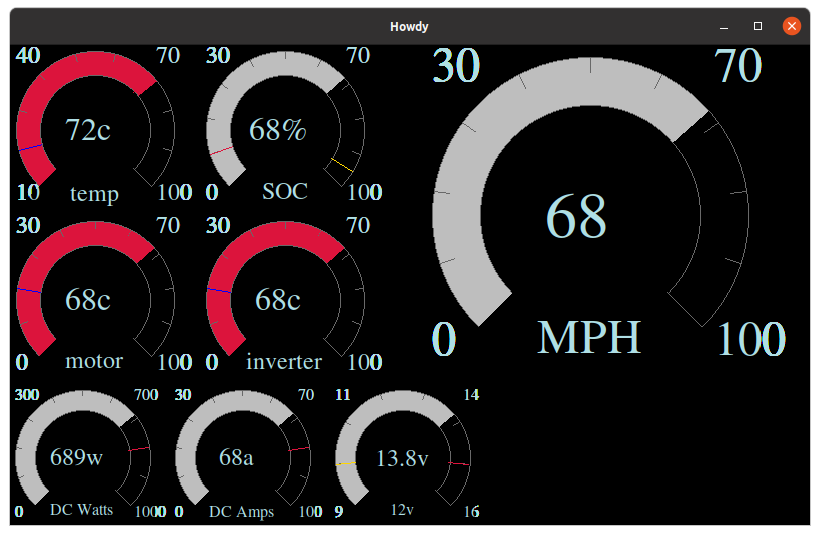

# EV Gauges

Arduino project to render gauge

More details on the EV conversion over at <https://github.com/dhiltgen/ev-conversion>

The original gauge cluster in my truck uses a mechanical speedo, and has
limited gauges.  For the 5.0 conversion, I had resorted to a row of AutoMeter
gauges bolted onto the dash, which wasn't ideal but worked for that setup.  At
this point, for an EV conversion it makes sense to just take the plunge and
build a custom cluster.  I'm planning to hook up an Arduino with to the CAN bus
coming from the major systems (LDU, SimpBMS, Charger, DC/DC) and use that to
instrument the system.

Instrument cluster dimensions

* 5.5 tall
* 15 wide
* 2-3 deep
* <https://www.buydisplay.com/arduino-display>
* Controllers:
* RA8875 - adafruit library
* SSD1963
* 8” Tft display should be optimal size

* UNO/Due/Mega 2560
* Uno - 5v, can handle 12-20v input power
* Mega - 5v, same voltage, more pins
* Due is 32bit and 3.3v
* EEPROM only good for 100k writes per location, with 512 bytes total. Rotate lowest byte through multiple locations to spread the writes out

Cluster ideas:

* Dc/dc: <https://openinverter.org/wiki/Tesla_Model_S/X_DC/DC_Converter>
* Input power watts
* Output amps
* Output voltage
* Coolant temp

LDU: hidden when charging

* On/off
* Fwd/rev
* Inverter and motor temp
* Dc amps, ac amps
* Pack voltage
* Rpm - mph

Bms:

* Status
* Charging
* Balancing
* Heating
* Pack temp min/max/ave
* Cell voltage min/max/ave
* Pack voltage
* Amps

Charger: hidden when driving

* Status
* Amps
* Ac voltage
* Evse status

